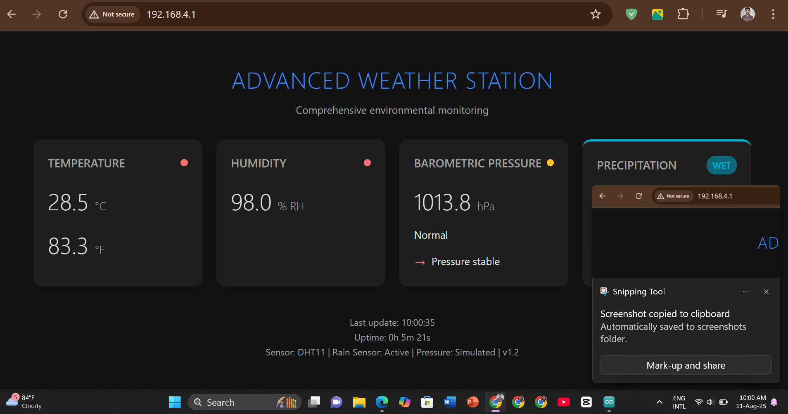

# Advanced Weather Station (ESP32 + DHT11 + Rain Sensor)

A DIY IoT weather station that monitors temperature, humidity, barometric pressure (simulated), and precipitation in real-time—displayed on a modern web dashboard hosted by an ESP32 microcontroller.

## Features

- 📡 **ESP32 WiFi Access Point**: No router needed! Connect directly to your weather station.
- 🌡️ **Temperature**: Real-time readings in °C and °F using DHT11.
- 💧 **Humidity**: Live %RH from DHT11.
- 🌧️ **Rain Sensor**: Analog detection of rain intensity (0–100%), with status (DRY, DAMP, WET, RAINING).
- ⬇️⬆️ **Barometric Pressure**: Simulated hPa readings and trend indication (Stable, Rising, Falling).
- 🖥️ **Responsive Web Dashboard**: Clean, dark-themed interface with status indicators, charts, and trends.
- ⏱️ **Uptime Monitor**: See how long your station has been running.
- 🟢 **Open Source**: Modify, improve, and share!

## Demo

### Hardware Setup
 

### Live Dashboard
 

## Components Used

- ESP32 Dev Board
- DHT11 Temperature & Humidity Sensor
- Analog Rain Sensor
- Breadboard & Jumper Wires
- (Optional) LEDs for status indication

## How it Works

1. **ESP32** creates its own WiFi AP. Connect via phone or PC.
2. Access `http://192.168.4.1` in your browser.
3. The dashboard auto-refreshes with real-time sensor data and trends.
4. Code is fully customizable for your own sensors or dashboard tweaks.

## Quick Start

1. **Wiring**
   - Connect DHT11 and Rain Sensor to ESP32 as shown in the schematic.
2. **Code**
   - Flash the provided Arduino sketch (`.ino` file) to your ESP32 using Arduino IDE or PlatformIO.
   - Libraries needed: `WiFi.h`, `WebServer.h`, `DHT.h`
3. **Connect**
   - Find WiFi named `WeatherStationPro`, password: `climate456`.
   - Open a browser, visit `http://192.168.4.1`.

## Code Overview

- `getSensorReadings()`: Reads temp, humidity, rain sensor, simulates pressure, and formats the data.
- `/`: Serves the dashboard HTML/CSS/JavaScript.
- `/data`: Serves sensor data (CSV).
- `/uptime`: Shows uptime in a friendly format.

## Circuit Diagram

> Add your schematic or Fritzing diagram here for clarity.

## Customization

- Adjust rain sensor calibration (`dryValue`, `wetValue`) to match your module and climate.
- Change WiFi SSID/password in the code for security.
- Easily extend to support more sensors (e.g., real barometric sensor).
